# 1、内容介绍
Weaviate (we-vee-eight) 是一个开源的AI原生向量数据库,可同时存储对象和向量，这样就可以将向量搜索与结构化过滤结合使用          
官网地址: https://weaviate.io/                         
github地址:https://github.com/weaviate/weaviate           
本次分享为大家演示如何安装部署、国内如何配置使用embedding模型、数据写入和查询                 
视频链接如下:             
https://www.bilibili.com/video/BV1LhUAYFEku/?vd_source=30acb5331e4f5739ebbad50f7cc6b949            
https://youtu.be/hD09V7jaXSo                     
# 2、前期准备工作
## 2.1 开发环境搭建:anaconda、pycharm
anaconda:提供python虚拟环境，官网下载对应系统版本的安装包安装即可                                      
pycharm:提供集成开发环境，官网下载社区版本安装包安装即可                                               
可参考如下视频进行安装，【大模型应用开发基础】集成开发环境搭建Anaconda+PyCharm                                                          
https://www.bilibili.com/video/BV1q9HxeEEtT/?vd_source=30acb5331e4f5739ebbad50f7cc6b949                             
https://youtu.be/myVgyitFzrA          

## 2.2 大模型相关配置
(1)GPT大模型使用方案              
(2)非GPT大模型(国产大模型)使用方案(OneAPI安装、部署、创建渠道和令牌)                 
(3)本地开源大模型使用方案(Ollama安装、启动、下载大模型)                         
可参考如下视频:                         
提供一种LLM集成解决方案，一份代码支持快速同时支持gpt大模型、国产大模型(通义千问、文心一言、百度千帆、讯飞星火等)、本地开源大模型(Ollama)                       
https://www.bilibili.com/video/BV12PCmYZEDt/?vd_source=30acb5331e4f5739ebbad50f7cc6b949                 
https://youtu.be/CgZsdK43tcY           

## 2.3 Docker安装和部署
### 2.3.1 本地部署
**(1)安装Docker**                                  
官网链接 https://www.docker.com/               
这里以Mac系统为例，windows无本质差别，根据自己的操作系统选择下载安装包，直接安装即可              
安装完成后，找到Docker图标双击运行，Docker服务启动成功后如下截图所示           
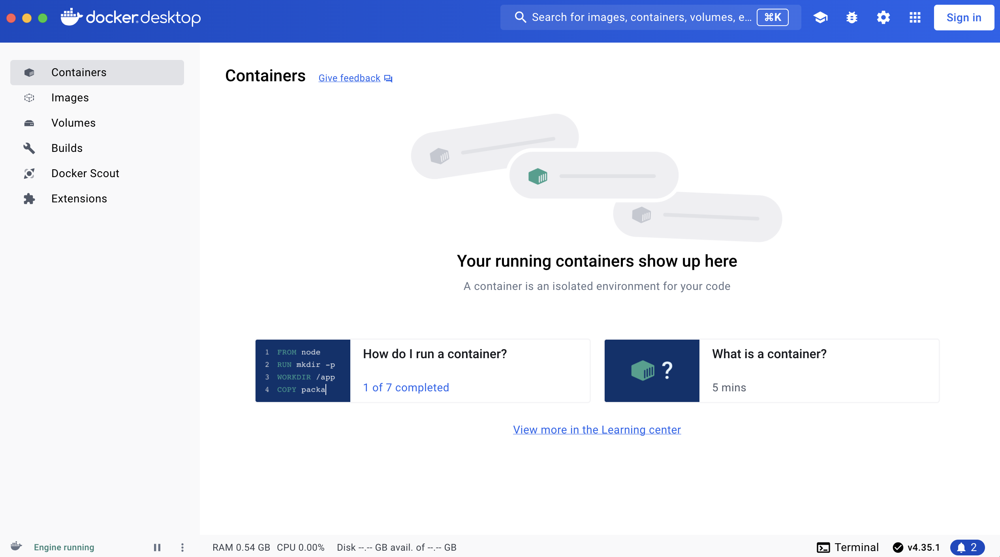                              
**(2)拉取并运行镜像**             
打开命令行终端，执行如下命令拉取weaviate的镜像             
docker run cr.weaviate.io/semitechnologies/weaviate:1.27.2                   
注意:经多次测试，这里需要科学上网，否则容易拉取失败(若无条件，不影响后续操作，可直接跳到步骤(4)继续)            
拉取完成后，会自动启动该服务，如下截图所示                 
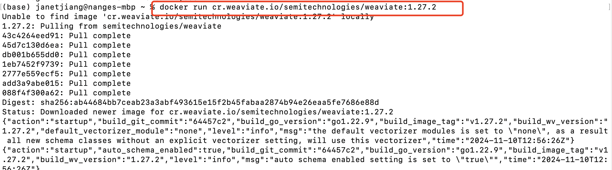                 
**(3)将镜像文件保存到本地**               
使用docker commit命令将现有的容器状态保存为新的镜像，这个过程类似于创建一个镜像的快照            
docker commit '当前的容器名称' ‘设置的新的镜像文件weaviate’             
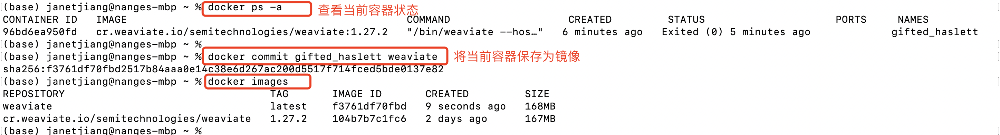                                  
然后再执行如下命令进行镜像本地保存，保存的文件为weaviate.tar                           
mkdir weaviate                  
cd weaviate                 
docker save -o weaviate.tar weaviate                
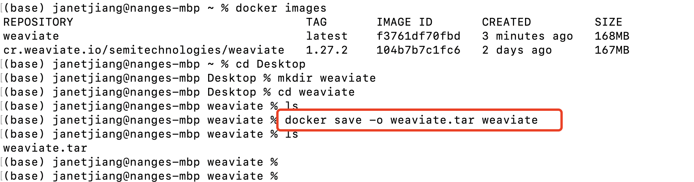         
**(4)加载本地镜像文件**             
为了对比测试，这里注意将科学上网给关闭，并将之前拉取的镜像全部删除                
按照如下截图删除容器               
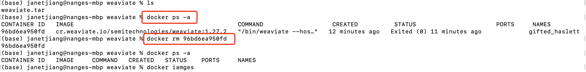     
按照如下截图删除镜像                
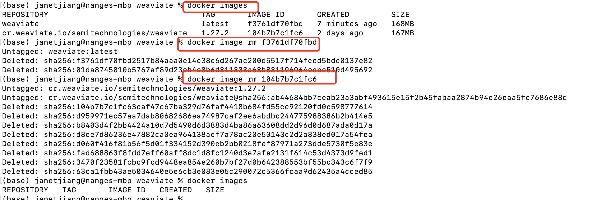    
删除完成后，进入到压缩文件所在的目录，执行如下命令加载本地镜像文件          
**注意：** 这里镜像文件使用上步生成的(若无条件生成文件可点击下面链接下载提前准备好的文件)              
链接: https://pan.baidu.com/s/1DXSwlp5FGuvIHQOC88QlkQ?pwd=gvjm 提取码: gvjm                   
docker load -i weaviate.tar            
命令执行后，再执行docker images查看是否加载成功，如下截图             
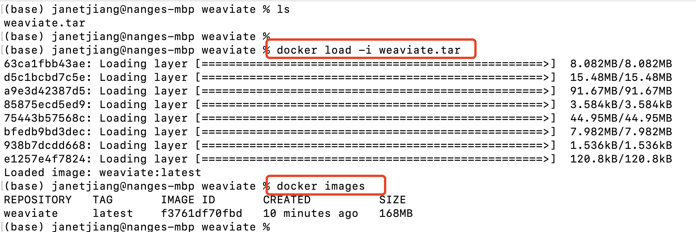                  
**(5)使用Configurator工具生成docker-compose.yml文件**            
使用weaviate官方提供的Configurator工具生成docker-compose.yml文件             
工具链接 https://weaviate.io/developers/weaviate/installation/docker-compose#configurator           
相关配置参数需根据自己的实际需求进行设置，这里可按照如下截图顺序进行配置               
(a)选择版本，这里选择1.27.0             
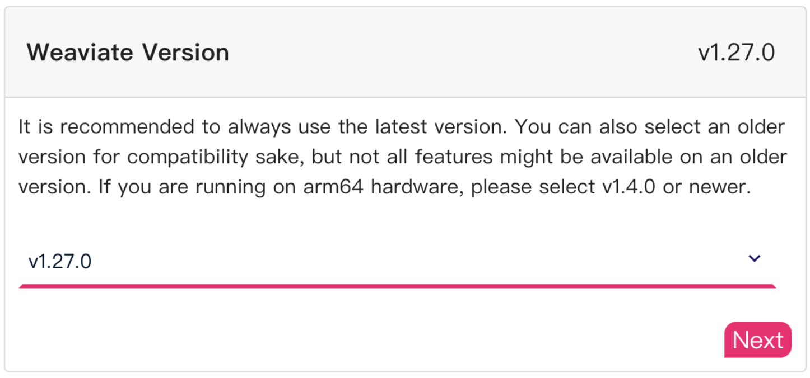           
(b)选择数据持久化方案，这里设置为host-binding方式                
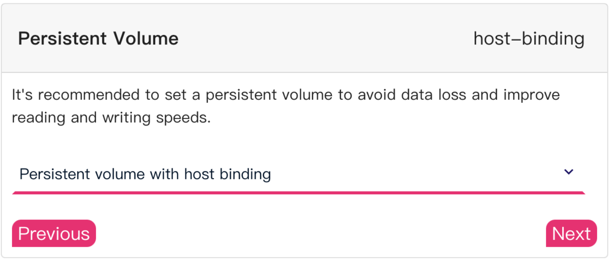               
(c)选择是否加载使用其他模块，这里选择加载模块               
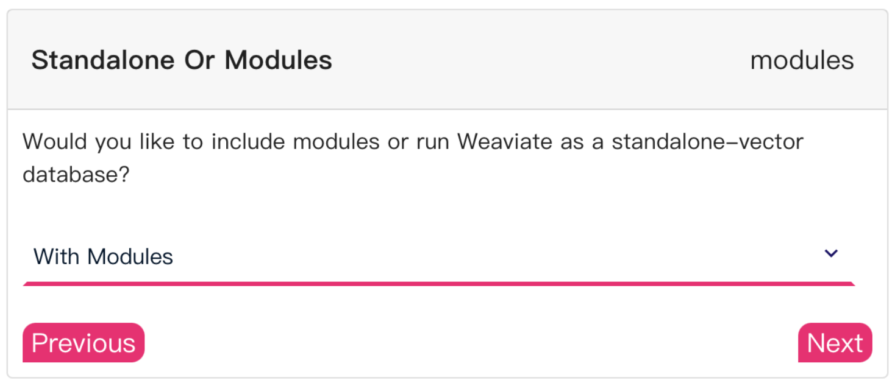               
(d)设置需要进行向量检索的媒体类型，这里选择文本              
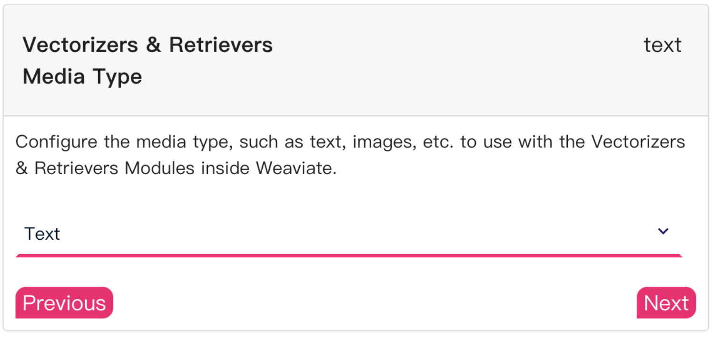               
(e)设置embedding模型，这里选择openai方案                
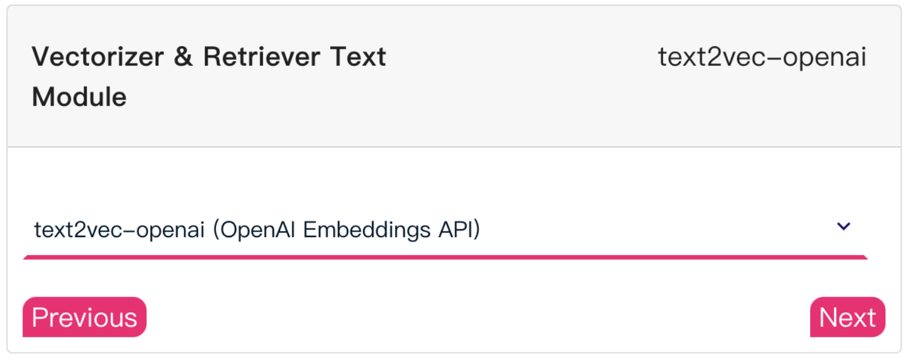               
(f)设置openai环境变量参数加载方案，选择每次请求时提供                 
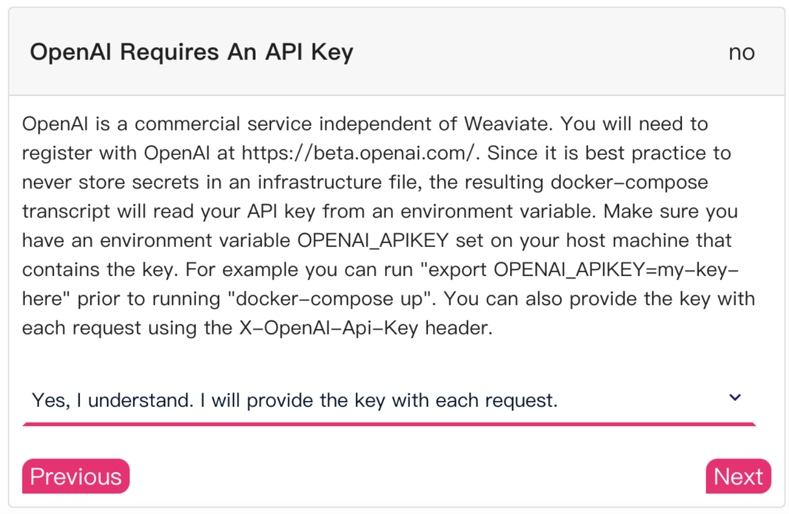               
(g)后续的配置全部默认即可                
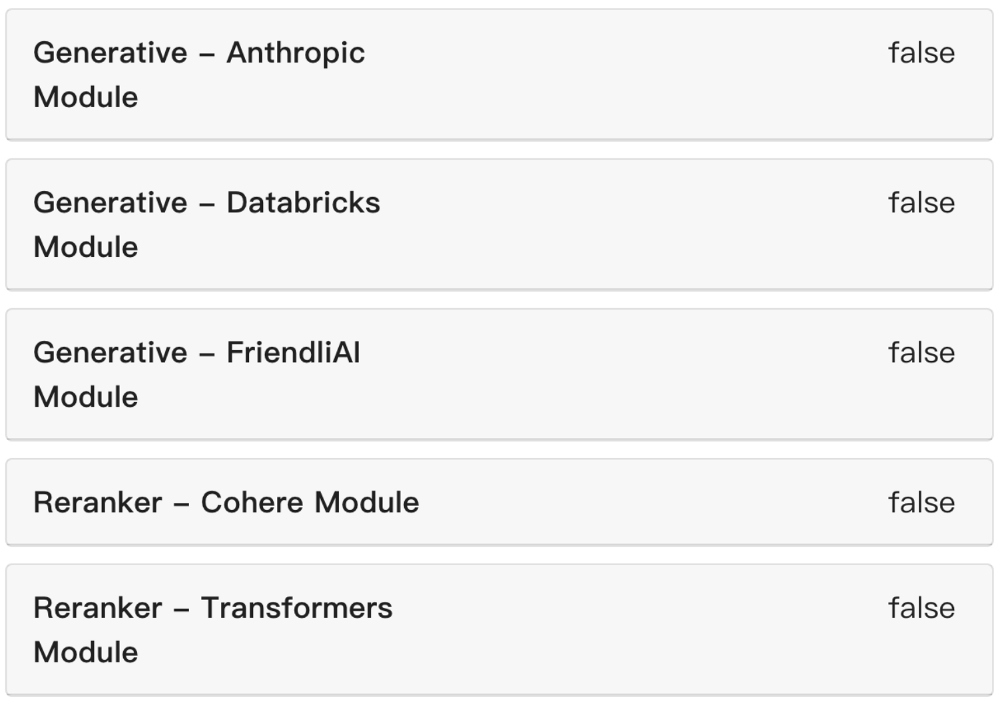            
(h)最后一项选择输出为Docker Compose               
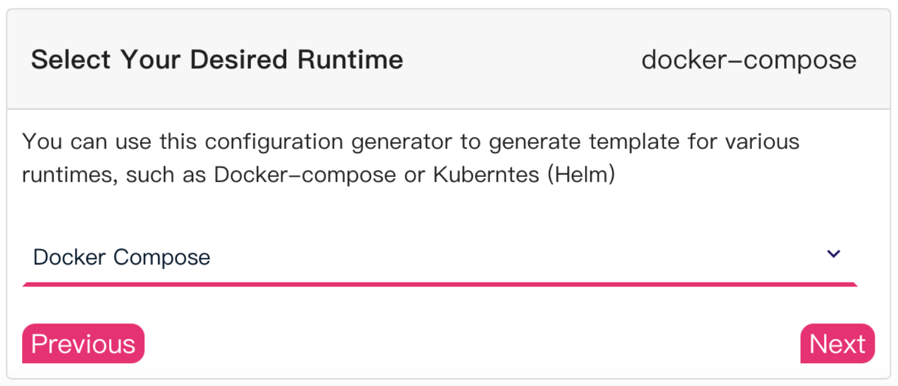             
到这里全部配置完成，会在页面下方生成docker-compose.yml文件相关的下载指令信息，如下截图          
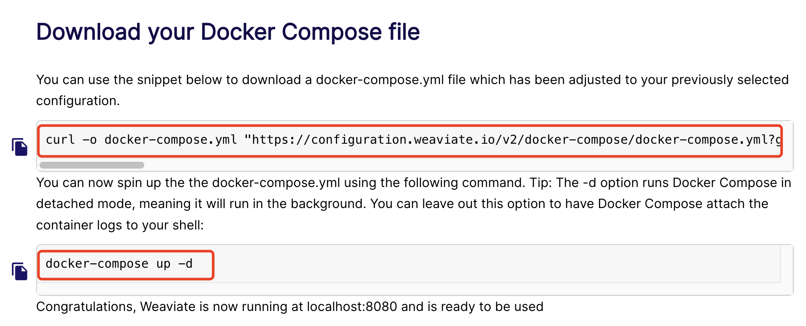             
**(6)下载docker-compose.yml文件并启动服务**              
将上个步骤根据配置生成的指令拷贝，粘贴到命令行终端中执行，如下截图             
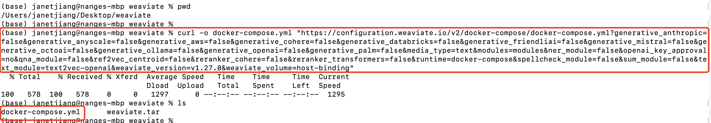     
文件下载成功后，按照如下截图修改文件内容，主要修改镜像文件名为weaviate              
sudo vim docker-compose.yml
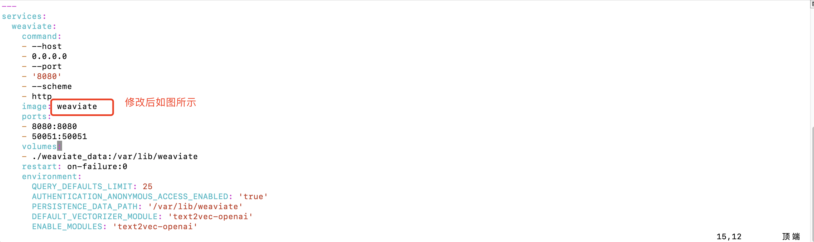          
修改成功后保存退出，然后执行如下命令启动服务                  
docker-compose up -d （后台运行）              
docker-compose up               
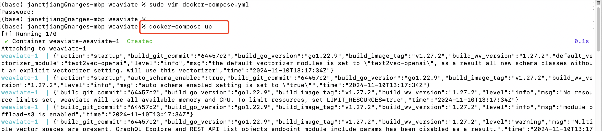             

### 2.3.2 服务器部署
**(1)安装Docker**           
这里使用的服务器是阿里云服务器，系统为Ubuntu22.04 LTS                  
安装步骤可参考:https://www.cnblogs.com/carmi/p/17939025                    
**(2)将文件上传到服务器**                      
远程登录到服务器，执行如下命令在opt目录下创建weaviate文件夹         
cd /opt              
sudo mkdir weaviate           
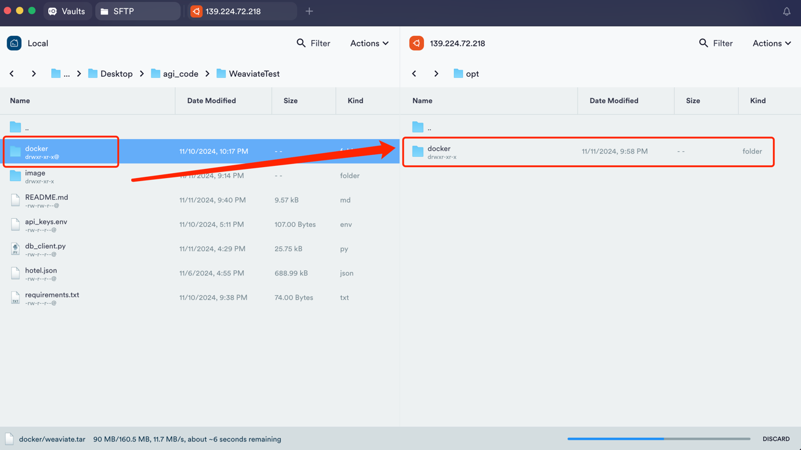            
然后使用SFTP将本地PC中创建的weaviate文件夹中的两个文件上传到服务器/opt/weaviate        
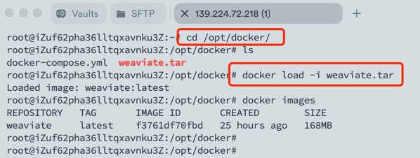            
**(3)加载本地镜像文件**                 
cd /opt/weaviate                     
docker load -i weaviate.tar               
加载成功后，再执行docker images查看是否加载成功              
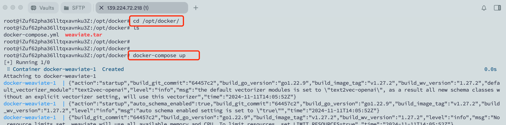                   
**(4)启动服务**        
docker-compose up -d （后台运行）           
docker-compose up              
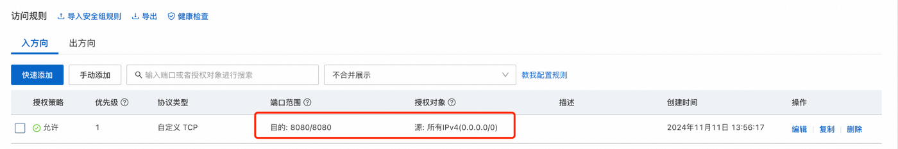               
**(5)在阿里云服务器中的安全组中添加8080端口**          
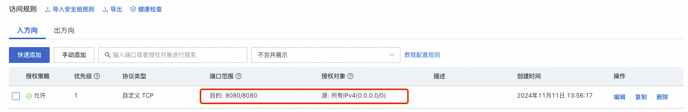            

# 3、项目初始化
## 3.1 下载源码
GitHub或Gitee中下载工程文件到本地，下载地址如下：                
https://github.com/NanGePlus/WeaviateTest                                                           
https://gitee.com/NanGePlus/WeaviateTest                                     

## 3.2 构建项目
使用pycharm构建一个项目，为项目配置虚拟python环境               
项目名称：WeaviateTest                                   

## 3.3 将相关代码拷贝到项目工程中           
直接将下载的文件夹中的文件拷贝到新建的项目目录中               

## 3.4 安装项目依赖          
命令行终端中执行如下命令安装依赖包                                           
pip install -r requirements.txt            
每个软件包后面都指定了本次视频测试中固定的版本号           
**注意:** 本项目weaviate使用的版本3.26.7，建议先使用要求的对应版本进行本项目测试，避免因版本升级造成的代码不兼容。测试通过后，可进行升级测试                    

# 4、项目测试
执行如下命令运行脚本测试写入数据和数据查询功能                  
python db_client.py              
(1)本地测试
修改代码中的url为:url="http://localhost:8080"                     
(2)阿里云服务测试         
修改代码中的url为:url="http://IP:8080"          
                    
         

              
              
